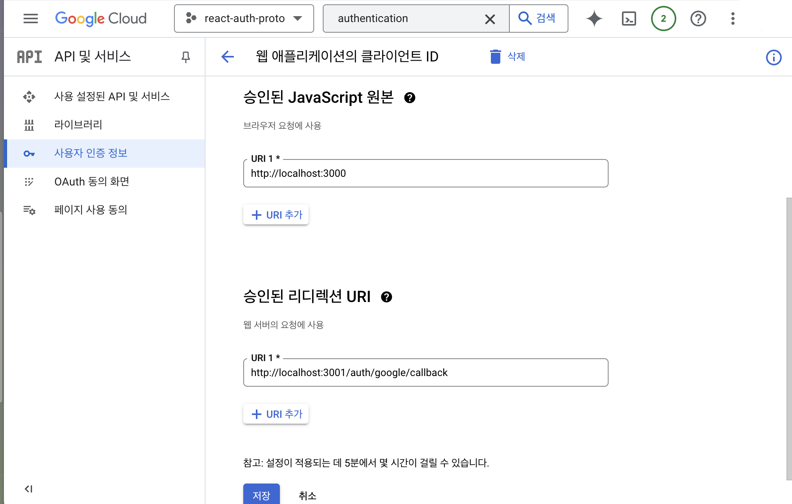

# 🐼 판다마켓 프로젝트

> _이 저장소는 판다마켓 프로젝트의 백엔드 코드를 관리하는 곳입니다. 프로젝트를 클론하여 개발 환경을 설정하고, 각 브랜치에서 해당 스프린트 미션을 수행해 주세요!_ 🛠️

## 소개

안녕하세요! 판다마켓 프로젝트에 오신 것을 환영합니다! 🥳
판다마켓은 따뜻한 중고거래를 위한 커뮤니티 플랫폼이에요. 여러분은 이곳에서 상품을 등록하고, 다른 사용자들과 소통하며, 자유롭게 이야기를 나눌 수 있어요. 매주 스프린트 미션을 통해 기능을 하나씩 만들어 가며 성장해 나가는 여정을 함께해요. 🚀


_위 이미지는 판다마켓의 대표 이미지입니다. 프로젝트가 진행됨에 따라 더 많은 이미지를 추가할 예정이에요!_ 📸

## 스프린트 미션이란? 🤔

스프린트 미션은 **하나의 개인 프로젝트를 길게 진행하면서, 그 과정에서 주기적으로 피드백을 받을 수 있는 시스템**이에요. 각 스프린트마다 배운 이론을 적용해 보고, **멘토님께 코드 리뷰를 받아가며 실력을 쑥쑥 키워갈 수 있는 중요한 개인 과제**랍니다. 💪

## 주요 기능 ✨

1. **상품 등록**: 내가 가진 물건을 올리고, 사진과 설명을 추가해 직접 판매할 수 있어요!
2. **문의 댓글**: 상품에 대한 궁금한 점이나 의견을 자유롭게 남길 수 있답니다. 📝
3. **자유게시판**: 다양한 주제로 친구들과 이야기를 나누고, 정보를 공유할 수 있는 공간이에요! 🗣️

## 프로젝트 브랜치 구조 🏗️

프로젝트는 단계별로 나뉘어 있고, 각 스프린트 미션에 맞는 브랜치가 있어요. 각 브랜치를 통해 체계적으로 개발하며 학습할 수 있어요. 🎯

### 브랜치 설명

1. **node (part1): 스프린트 미션 4의 BE 요구사항**
   - 백엔드 서버 설정과 간단한 API 구현을 위한 Express.js 초기 구성이 포함됩니다.
2. **express (part2~4): 스프린트 미션 6 ~ 12의 BE 요구사항**
   - Express.js, 데이터베이스 연동, 인증 및 권한 관리 등 고급 API 설계를 구현합니다.

> 프론트엔드 요구사항은 [프론트엔드 저장소](https://github.com/codeit-sprint-fullstack/13-sprint-mission-fe)에서 관리합니다.

---

## 현재 브랜치 실행 안내

## 실행하기

### 도커를 통하여 실행하기

도커를 사용하면, 환경에 구애받지 않고 어플리케이션을 쉽게 개발 및 실행할 수 있습니다.

해당 장에서는 도커에 대해 자세하게 설명하지 않습니다.
자세한 사항은 [도커 공식문서](https://docs.docker.com/desktop/)를 참조해주세요.


#### 준비물

- npm
- docker
- docker-compose

#### 실행하는 방법

```shell
npm run compose
```

docker-compose 를 통해 실행했다면, postgresql 은 도커 내부에 자동적으로 만들어집니다.

아래는 자원의 접근 정보입니다.

**DB**

- `PORT` : 15432 (localhost:15432 으로 접근)
- `USER_NAME` : postgres
- `USER_PASSWORD` : postgres

**Service**

- `PORT` : 13000 (localhost:13000 으로 접근)

그 외에 필요한 환경 변수들은 아래를 참고하여 설정해 주셔야 합니다.


### 로컬 환경에서 실행하기

#### 준비물

- nodejs
- postgresql

#### 실행 전, 필요한 작업

1. 의존성 설치

서비스가 동작하기 위해 필요한 라이브러리를 설치합니다.

```shell
npm install
```

2. `.env` 파일 설정

이미지 업로드시 노출시킬 서버의 주소를 `BASE_URL`로 설정해 주세요. 이때 주소의 마지막에 슬래시(`/`)는 포함하지 않습니다.
서버를 실행할 포트 번호를 `HTTP_PORT`에 원하는 값으로 설정해 주세요. 포트 값을 설정하지 않으면 기본 값은 3000으로 실행됩니다.

```
BASE_URL=http://localhost:3001
HTTP_PORT=3001
```


PostgreSQL 접속정보를 환경변수에 반영해야 합니다.
아래 포맷에 맞추어 `DATABASE_URL` 값을 수정해 주세요.

```
DATABASE_URL=postgresql://{userName}:{password}@{dbHost}:{dbPort}/{dbName}
```

JWT 생성 발급을 위한 시크릿 키와 구글 계정 관련 정보도 설정해 주세요. 이때 CLIENT_REDIRECT_URI는 소셜 로그인을 마치고 인증 토큰을 담은 쿼리 스트링과 함께 클라이언트가 최종 도착할 URI입니다.

```
JWT_ACCESS_TOKEN_SECRET=<사용할 secret key>
JWT_REFRESH_TOKEN_SECRET=<사용할 secret key>
GOOGLE_CLIENT_ID=
GOOGLE_CLIENT_SECRET=
GOOGLE_REDIRECT_URI=
CLIENT_REDIRECT_URI=
```

위에서 필요한 `GOOGLE_CLIENT_*` 값들은 구글 Credentials에서 OAuth 클라이언트를 설정할 때 얻을 수 있습니다.

구글의 Credentials에서 OAuth Client를 생성할 때 `/auth/google/callback` 이라는 경로를 기준으로 허용 승인된 리디렉션 URI를 추가해 주세요.


3. Prisma Client 생성

`@prisma/client`는 로컬의 `schema.prisma` 파일을 읽어서 만들어지는 패키지입니다.
처음 설치하거나 스키마 파일이 변경되면 아래 명령어를 실행해 주세요.

```shell
npm run prisma:generate
```

4. DB 마이그레이션

서비스를 운영하기 위해 필요한 테이블들을 생성해야 합니다.

- Article
- Product
- Comment

```
npx prisma migrate deploy
```

PostgreSQL 접속정보가 올바르지 않다면 실패할 수 있습니다.


5. DB Seeding (선택)

```
npm run seed
```

6. 서비스 실행

```
npm start
```

혹은 개발 중 `nodemon`으로 실행하고 싶다면 아래 명령어를 사용하면 됩니다.

```
npm run dev
```

## TypeScript 개발 환경

서버 코드는 TypeScript로 작성되어 있으며 `tsconfig.json`의 `outDir`은 `dist`입니다.

```shell
npm run typecheck
npm run build
npm start
```

개발 중에는 `nodemon`이 `.ts` 파일 변경을 감지하고 `ts-node`로 서버를 다시 실행합니다.

```shell
npm run dev
```

테스트는 테스트 파일까지 타입 검사한 다음 `ts-node` 환경에서 실행합니다.

```shell
npm test
```

---

본 프로젝트는 [코드잇](https://www.codeit.kr)의 소유이며, 교육 목적으로만 사용됩니다. © 2026 Codeit. All rights reserved.
